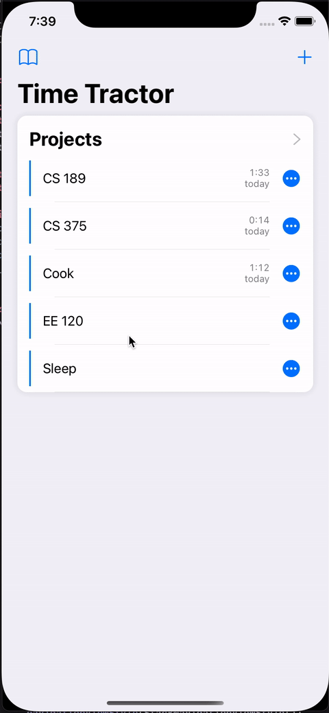

# TimeTractor

TimeTractor is an iOS app that allows you to easily track your time.

## Demo

## Technologies

TimeTractor uses the GRDB library for data persistence. 
The main user interface is written in UIKit and uses a Collection View using Compositional Layout and a Diffable Data Source.
The UI for adding or changing a timer is written in SwiftUI.

